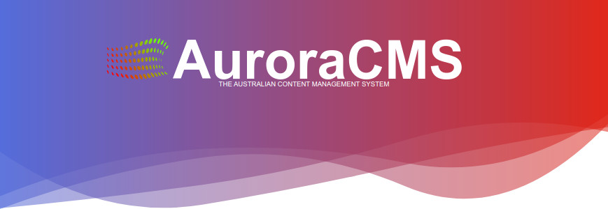

AuroraCMS the **Free** Australian Open Source [MIT](https://github.com/DiemenDesign/AuroraCMS/blob/master/LICENSE) licensed Content Management System, built primarily for Australian Businesses, built utilising [PHP](http://php.net/), PDO, [jQuery](http://jquery.com/) and [iCONS](https://github.com/DiemenDesign/iCONS). Built to take advantage of HTML5 and CSS3, with necessary SEO attributes that fit in with Google's recommendations, Micro-formats, JSON-LD, ARIA (A11Y), and general SEO Markup.

Current version is v0.2.6

### Features
- AuroraCMS is a Quasi-MVC, Front End is completely MVC, with some AJAX Functions for Form Processing.
- Accessibility (A11Y) Widget that can be enabled to allow site visitors to change settings to allow those with disabilities to use the website more easily, and to adhere to the Australian Accessibility Law.
- Hosting and Site Payments for Developers.
  - When setup, Hosting and Site Payment notifications are displayed on the Dashboard of Client Sites.
    - Show Status of Hosting Payments, Overdue by days which has an alert animation to attract attention, Outstanding due date, Paid with number of days.
    - Show Status of Site Payment as Site is paid off.
- Forms
  - Editable minimum and maximum times to submit forms. (Too Fast, is possible Bot Submission).
  - Hidden Captcha taking Screen Reader user's into account, so they don't get trapped.
  - Optional Google reCaptcha v2 for Forms.
  - Form Filtering for Blacklisted editable text lists.
  - Project Honey Pot Blacklist IP Filtering.
- No Plugins. AuroraCMS does use some Third Party Script's, that are security vetted.
- Business Hours Editor.
- Content Scheduler with Auto Content Publishing.
- Related Content, either Chosen or Category matched.
- Custom Pages.
- Articles.
- Portfolio.
- FAQ's.
- Events.
  - Book Events and Invoice for immediate payment.
  - Option to display Countdown Clock for when Event Starts.
  - Display Events on Home Page.
- News.
  - Display News on Home Page.
- Testimonials.
  - Approval before public display.
- Inventory.
  - Quick View Option for Inventory.
  - Product Reviews and Approval before public display.
  - Assign Points to Items, that get added to user's Earned Points.
  - Restrict Wholesale Items to Wholesale Account per Level.
- Services.
- Gallery.
- Client Proofs.
- Messages.
- Newsletters.
- Bookings.
  - Convert booking to invoice.
  - Print booking.
  - Signature taking and storage for confirmation of Services.
- Messaging.
  - Whenever a message is created via the Contact Us page, it can be stored in the messages system as well as emailed.
  - Live Chat. Choose between the built in Live Chat, or easily integrate Facebook Messenger.
- Orders.
  - Create quotes, invoices. Client viewing of Orders.
  - PayPal Integration for Accepting PayPal and Credit Card Payments.
  - Stripe Integration for Accepting Credit Card Payments (includes enabling AfterPay).
  - Australia Post API Integration for Calculating Postage Costs.
  - Deduction rows to allow multiple payments showing date of payment, editable title, amount, and total left owing.
  - Rewards with percentage or value off, date period available, quantity usage.
  - Discount Range Calculation depending on Account Expenditure.
  - GST Calculating.
  - Payment Options with Surcharge options.
  - Create New Quote/Invoice from selected items.
- TODO/Joblist in a Kanban board.
- Forum
  - Post, Reply as per other Forums.
  - Integrated Help Tickets as Forum Posts.
  - Upvote or Downvote posts and comments.
- Banner Notifications with Entrance Animation choice. Dissmissable with local storage variable.
- Media.
  - Upload and manage various types of files for addition into content using elFinder.
  - Auto resizing, makes thumbnails and Large, Medium and Small versions of images for use with srcset.
- Featured Content.
  - Can use Content Items as Featured Content, or Images and HTML Templates uploaded into the `media/carousel/` folder. Which then will get sorted, and number of items displayed depending on the settings attributes in the `featured.html` template file.
- Accounts.
  - Create Accounts for co-workers with Account Types for:
    - Administrators.
    - Editors (especially good for SEO and Copywriters).
    - Client's.
    - Members with Silver/Bronze/Gold/Platinum
      - Default and Account editable purchasing limits.
    - Visitors.
    - Wholesalers with Silver/Bronze/Gold/Platinum
      - Default and Account editable purchasing limits.
      - Approval of Wholesaler Purchasing.
      - Time limited purchasing, disables purchasing if purchases are not made inside maximum time limit (this encourages Wholesalers to continue purchasing).
- Client Proofs and Commenting.
- Easy Theme Selector.
  - Themes are built in such a way that changes in Administration are carried over to other themes. However, this will also depend on the features built into the theme selected.
- Front End Theme Engine using HTML Style Markup, the use of any CSS or JavaScript Framework.
- Administration uses jQuery, iCONS, and other jQuery Addons.
- Activity Fingerprint Analysis Logs of Previous Content Changes with Undo, and who made the changes. Examine Content Inputs with Draggable Popover with Undoing.
- Suggestions Editor to allow Administrators and Content Editor to make Editing Suggestions with Reasons, and Click Adding of Suggestions.
- SEO Information.
  - Informational Popups for important items for client's to learn SEO.
- Security.
  - Spam Filter than can Auto Blacklist IP's using custom blacklist text files that can be edited.
  - Project Honey Pot Integration that can Auto Blacklist when check IP's against the httpBL API Service when forms are submitted via visitors.
  - Ability to Add suspicious visitor interactions to Blacklist.
  - 30 Day Auto-Clearance of Blacklisted IP's.
  - Site Block if visitor's IP is listed in Blacklist, saving server resources, and to hopefully stop Spammers or Email Harvester's.
  - Database Backup and ability to Prefix Table Names.
  - Blacklist IP's that try to access WordPress based files or attempt WordPress Access.
  - Developer "Lock Down", this stops accounts lower than the developer from taking the website out of "maintenance" or "Coming Soon" modes.
- Page and Visitor Tracking for Analytics.
  - Records visit counts per IP, stores IP and Browser Information, with option of clearing data.
- Progressive Web Application (PWA) Service Worker for Offline Pages.
- GDPR Privacy Notice Compliance.
  - For those providing Services and or Products to Countries that require Privacy Cookie Consent.
- Open Street Maps via the Leaflet JavaScript library.
  - Address location Map can be displayed on Home Page, Contact Us, and Event Items.
- Multiple Custom Summernote (WYSIWYG Editor) Addons, created by Diemen Design.
  - [summernote-audio](https://github.com/DiemenDesign/summernote-audio)
  - [summernote-checkbox](https://github.com/DiemenDesign/summernote-checkbox)
  - [summernote-classes](https://github.com/DiemenDesign/summernote-classes)
  - [summernote-cleaner](https://github.com/DiemenDesign/summernote-cleaner)
  - [summernote-ext-elfinder](https://github.com/semplon/summernote-ext-elfinder)
  - [summernote-image-captionit](https://github.com/DiemenDesign/summernote-image-captionit)
  - [summernote-image-shapes](https://github.com/DiemenDesign/summernote-image-shapes)
  - [summernote-save-button](https://github.com/DiemenDesign/summernote-save-button)
  - [summernote-text-findnreplace](https://github.com/DiemenDesign/summernote-text-findnreplace)
  - [summernote-video-attributes](https://github.com/DiemenDesign/summernote-video-attributes)

You can get themes from our Themes GitHub Repository @ [AuroraCMS-Themes](https://github.com/DiemenDesign/AuroraCMS-themes)

### Dependencies
- PHP > 7.0 - Must have PDO, and Password Compat support. If you have tried AuroraCMS with a higher version, please report your experiences.
- Works with PHP 7+. Please make sure PHP Libraries are installed before reporting Issues.
- Works with PHP 8+. Please make sure PHP Libraries are installed before reporting Issues.
- mod_rewrite or rewrite.
- mbstring.
- xml functions.
- GD-Image & Imagemagick- AuroraCMS will work without them, but things like Order PDF Viewing, Thumbnails, and image resizing won't work.
- mail services - Are needed for mail notification sending, Orders Sending and for the Newsletters.

#### Integrated Projects:
- [iCONS](https://github.com/DiemenDesign/iCONS)
- [Summernote](https://github.com/summernote/summernote) Skunkworks Version (In Development)
  - [summernote-audio](https://github.com/DiemenDesign/summernote-audio)
  - [summernote-checkbox](https://github.com/DiemenDesign/summernote-checkbox)
  - [summernote-classes](https://github.com/DiemenDesign/summernote-classes)
  - [summernote-cleaner](https://github.com/DiemenDesign/summernote-cleaner)
  - [summernote-ext-elfinder](https://github.com/semplon/summernote-ext-elfinder)
  - [summernote-image-captionit](https://github.com/DiemenDesign/summernote-image-captionit)
  - [summernote-image-shapes](https://github.com/DiemenDesign/summernote-image-shapes)
  - [summernote-save-button](https://github.com/DiemenDesign/summernote-save-button)
  - [summernote-text-findnreplace](https://github.com/DiemenDesign/summernote-text-findnreplace)
  - [summernote-video-attributes](https://github.com/DiemenDesign/summernote-video-attributes)
- [CodeMirror](https://github.com/codemirror/CodeMirror)
- [FullCalendar](https://github.com/fullcalendar/fullcalendar)
- [PHPMailer](https://github.com/PHPMailer/PHPMailer)
- [Zebra_Image](https://github.com/stefangabos/Zebra_Image)
- [kses](https://github.com/RichardVasquez/kses)
- [elFinder](https://github.com/Studio-42/elFinder)

### Tested on:
- CentOS Linux 7.2.1511 with Webmin 1.791
- Ubuntu Linux 14.04 + Apache v2.4.7 + PHP v5.6-7.3 + MySQL v5.5.37
- Linux Mint Ubuntu Edition Apache 2.4.7 + PHP v5.6-7+ & MySQL v5.5.37
- Linux Mint Debian Edition Apache 2.4.7 + PHP v5.6-7+ & MySQL v5.5.37
- Debian 7 + nGinx + PHP 5.5-7.3 + MySQL
- Windows 7 + WAMP + PHP 5.5 + MySQL

### TODO:
Consult the everchanging [TODO](https://github.com/DiemenDesign/AuroraCMS/blob/master/TODO.md) file.

### UPDATING:
Other than updating files, which can be done by simply overwriting them, the database occasionally has new or changed fields, changes that can be run in phpMyAdmin will be in the root folder as `update.sql`, and will change at each release.

### LEGAL:
By downloading AuroraCMS you hereby agree not to hold Diemen Design liable for any damages that your usage of AuroraCMS may cause to your system, or persons. Damages may infer such things as Data Loss, Aural or Visual Impairment, Server Crashes, Alien Abduction, Coding nightmare's, Alien Implants, or Visiting Alternate Realities. AuroraCMS is Licensed under [MIT](https://github.com/DiemenDesign/AuroraCMS/blob/master/LICENSE). We request that if you modify, and hopefully enhance AuroraCMS, that you take part in maintaining, and contributing to it's code base here at GitHub.

### Contributors:
- [Raycraft Computer Services](https://www.raycraft.com.au/)
  - Live Testing, Suggestions, and witty Banter.
- GitHub User [Digifolder](https://github.com/Digifolder)
  - Windows Testing, bug finding and reporting.

### AuroraCMS Live Sites by Diemen Design:
- [Anime Excess](https://animeexcess.com.au/)
- [BizzyKnits](https://bizzyknits.biz/)
- [Budget Skips Express](https://budgetskipsexpress.com.au/)
- [Corner Life Coach](https://corner.net.au/)
- [Cradle Mountain Fishery and Camping](https://cradlemountainfisheryandcamping.com.au/)
- [Cradle Mountain Message](https://cradlemountainmassage.com.au/)
- [Diemen Design](https://diemen.design/)
- [EntertainMe](https://entertainme.net.au/)
- [Fast Track Business Club](https://www.fasttrackbusinessclub.com.au/)
- [Happy Valley Goat Farm](https://happyvalleygoat.farm/)
- [Hays Computer World](https://hayscomputerworld.com.au/)
- [K9FineDining](https://k9finedining.com/)
- [Lone Wolf Anime](https://lonewolfanime.com.au/)
- [Raycraft Computer Services](https://www.raycraft.com.au/)
